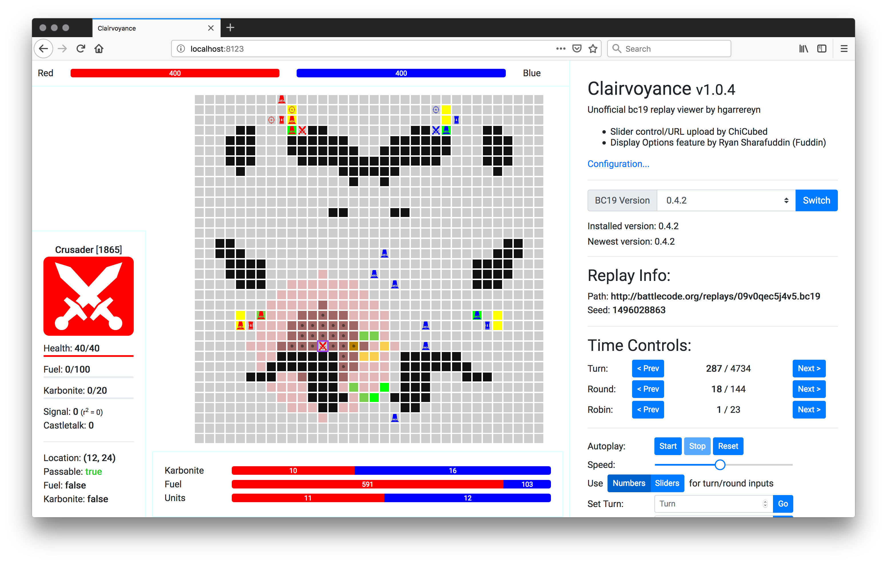

# Clairvoyance

An unofficial, offline replay viewer for Battlecode 2019

# Quick-start

1. Clone this repository
2. `cd` into it
3. Run `npm install` to install dependencies
4. Run `node index.js` to launch the server
5. Navigate to `http://localhost:8123`

# Note

Since Clairvoyance uses the bc19 internal api, it is buggy in the same way as the official viewer. Therefore, you may need to use Firefox in order to view certain replays.

If a replay looks strange to you, try switching to a different version of bc19.

# About

Clairvoyance is composed of a NodeJS/express backend and a mostly JavaScript frontend.

The bc19 package is a dependency and Clairvoyance uses the official Game class to parse replays (this is also how the official replay viewer works).

Text and UI components are drawn with native javascript by editing the DOM. The game itself is drawn on a canvas using PixiJS.

Clairvoyance is capable of automatically reloading when the replay file changes (as in, it is replaced by another call to `bc19run`). This is achieved by an `fs.watch` command on the backend followed by a socket message to the client. The client will then request `/replay` from the server which loads the replay from disk.

# Features

* Auto-reload
    * provide the path to a `replay.bc19` file and Clairvoyance will automatically reload it when it changes
* Smooth controls
    * drag to move
    * scroll to zoom
* Fine-grained time controls:
    * step forward or backwards by turn/round/robin
    * jump to a specific turn or round
    * click a button to auto-run the replay
        * with speed control (thanks to ChiCubed)
* Tooltip information on gridpoint hover
    * shows tile information
    * shows unit information (when applicable)
* Descriptive visual information
    * units have healthbars
    * see move vectors, attack vectors and creation vectors
* Turn queue
    * see the order that robots will run
* Stats
    * view fuel and karbonite per team
* Live-switch between versions of bc19 in the browser
    * scrim replays work!

# Ideas? Problems?

Do you have ideas for features? Did you find bugs? Please submit an issue or even better, make a pull request!
